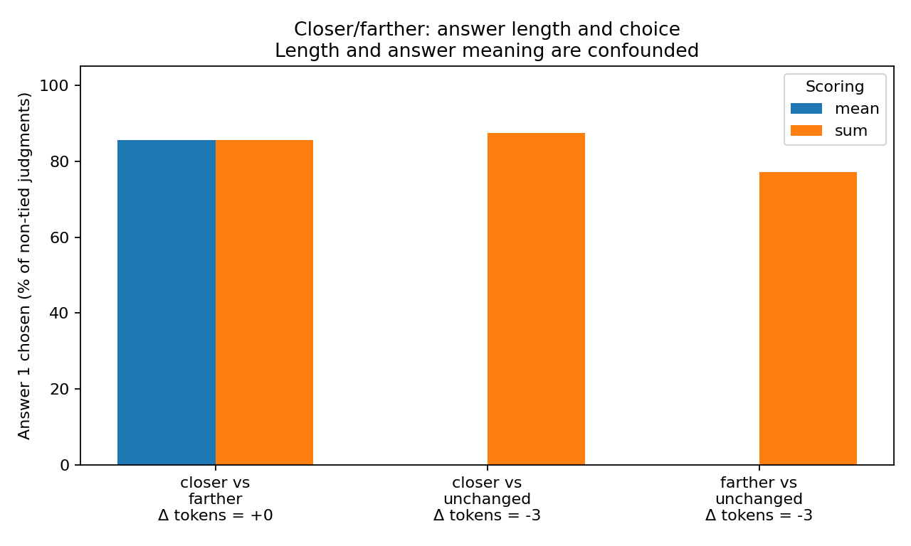

# Answer token length versus model choice

Point-biserial r = Pearson(delta conditional answer tokens, answer1 chosen); ties excluded from r and shorter-choice rate, counted incorrect for accuracy.

Delta length is answer 1 minus answer 2. Negative r means a larger relative length for answer 1 is associated with less frequent selection of answer 1. This is NOT the same statistic as the fraction choosing the shorter answer. Counts are rendered binary judgments. The primary table is an ordinary, unweighted point-biserial correlation; balanced estimates follow separately.

| Category | Judgments | Unequal lengths | Mean r | Sum r | Mean: shorter chosen | Sum: shorter chosen |
|---|---:|---:|---:|---:|---:|---:|
| above_below | 4,608 | 0 | N/A | N/A | N/A | N/A |
| close_far | 2,304 | 0 | N/A | N/A | N/A | N/A |
| closer_farther | 18,648 | 10,656 | +0.8790 | +0.0444 | 0.00% | 82.30% |
| east_west | 1,296 | 0 | N/A | N/A | N/A | N/A |
| left_right | 4,608 | 0 | N/A | N/A | N/A | N/A |
| north_south | 1,296 | 0 | N/A | N/A | N/A | N/A |
| overall | 32,760 | 10,656 | +0.6318 | -0.1584 | 0.00% | 82.30% |

## Benchmark-balanced diagnostics

Equal category/family/case/evidence/wording-cell weighting, conditional on each column's eligible comparisons. Shorter/longer accuracy includes ties as errors. These are not unweighted count percentages.

| Scoring | Weighted r | Shorter chosen | Correct shorter: accuracy | Correct longer: accuracy | Equal length: accuracy |
|---|---:|---:|---:|---:|---:|
| mean | +0.2863 | 0.00% | 0.00% | 100.00% | 51.29% |
| sum | -0.1132 | 85.50% | 89.41% | 18.40% | 51.29% |

## Length gaps and answer identity

| Category | Contrast | Tokens: answer 1/2 | Token difference | Judgments | Mean: answer 1 chosen | Sum: answer 1 chosen |
|---|---|---|---:|---:|---:|---:|
| above_below | above_below | 7/7 | +0 | 4,608 | 55.77% | 55.77% |
| close_far | close_far | 7/7 | +0 | 2,304 | 72.92% | 72.92% |
| closer_farther | closer_vs_farther | 10/10 | +0 | 7,992 | 85.61% | 85.61% |
| closer_farther | closer_vs_unchanged | 10/13 | -3 | 5,328 | 0.00% | 87.50% |
| closer_farther | farther_vs_unchanged | 10/13 | -3 | 5,328 | 0.00% | 77.10% |
| east_west | east_west | 9/9 | +0 | 1,296 | 50.23% | 50.23% |
| left_right | left_right | 12/12 | +0 | 4,608 | 53.12% | 53.12% |
| north_south | north_south | 9/9 | +0 | 1,296 | 50.00% | 50.00% |

Equal-length categories have undefined length correlation, not zero correlation. A correlation can also be undefined if the model always chooses the same candidate.

For this saved dataset, unequal lengths occur only in closer-versus-unchanged and farther-versus-unchanged contrasts. The unchanged answer is three tokens longer. Within these contrasts the gap is constant, so the effect of token length cannot be separated from the meaning/wording of the answer. No causal length effect can be estimated here.

Why summed scoring can choose the shorter answer frequently yet have near-zero r within closer/farther: answer 1 is also chosen frequently in the equal-length closer-versus-farther contrast. The correlation compares these contrast types, whereas the shorter-choice rate considers only unequal lengths. Pooled cross-category r adds further category-composition effects.

## Uncertainty and scope

- Association is not causation; length is confounded with answer identity and contrast.
- Raw r weights rendered judgments equally. Balanced r uses the benchmark hierarchy; it is weighted Pearson with a binary outcome.
- Counts include repeated contexts and wording variants, not independent samples. No iid p-values are reported.
- Bootstrap resamples scene cases within fixed families, sharing draws across matched axes. Singleton strata stay fixed.
- No length-association CI is reported when all length-informative strata are singletons; a degenerate bootstrap would imply unjustified precision.
- Scores describe evaluated left/right v1.0, not the shortened v1.2 wording. Front/behind has not been evaluated and is excluded.

Conditional scene bootstrap: 10,000 replicates, seed 42. Detailed metric availability and eligible cluster counts are in summary.json. The current length-informative strata are all singletons, so their length-association CIs are not estimable.

Lengths are the conditional target tokens actually scored—not whitespace words, standalone-tokenizer counts, or context-plus-answer length. Sums use saved token log probabilities where available, otherwise saved mean times conditional token count (subject to float rounding). No model inference was rerun.

